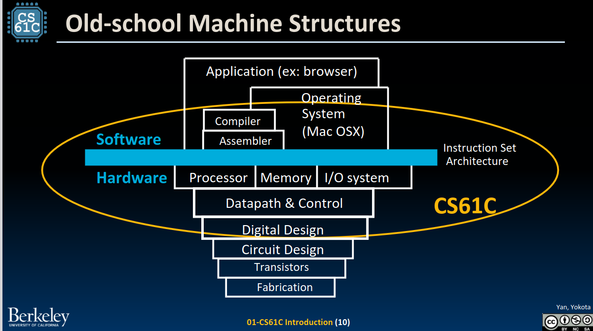
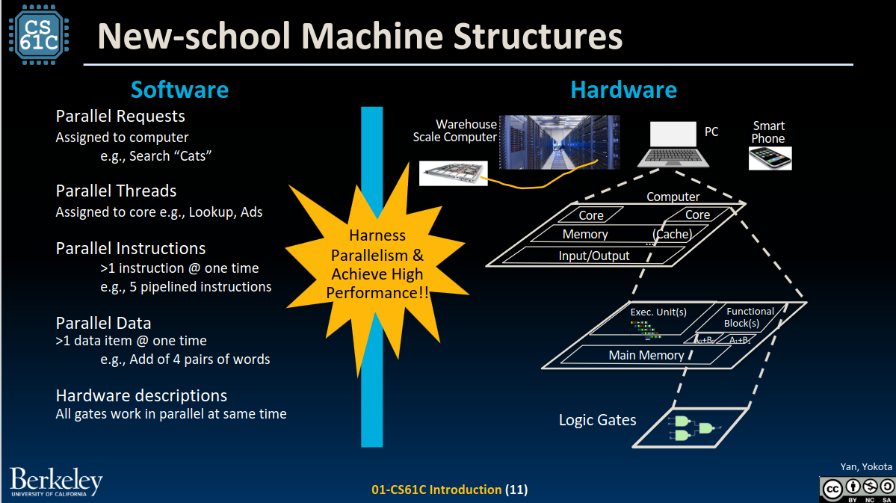
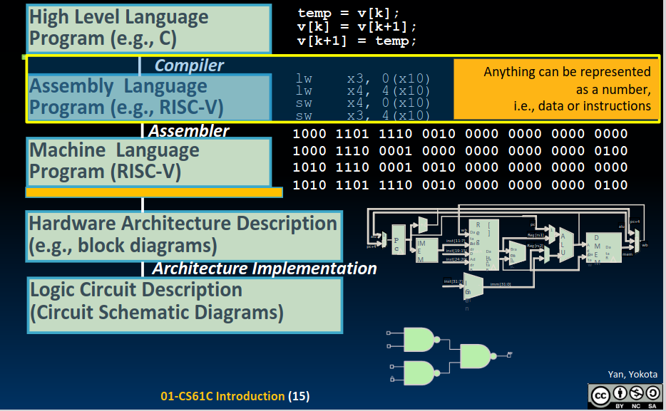
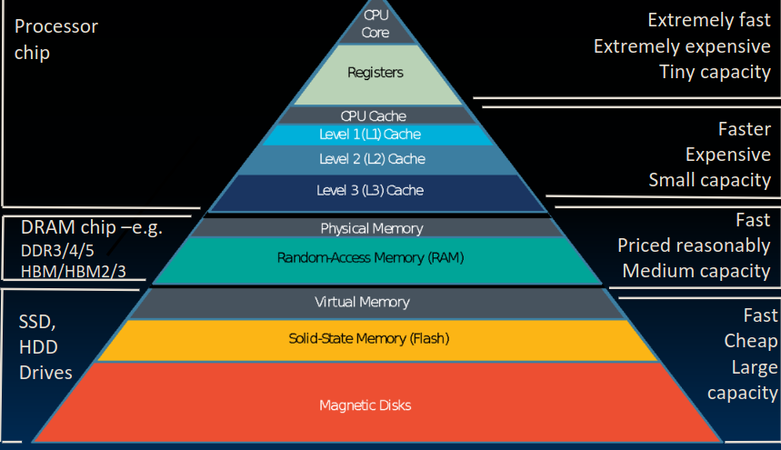

# Lecture1 Intro

## 主要内容

* 想一想计算机结构
* 计算机体系结构里的伟大构想
* 在这门课程需要学到的东西

## 计算机结构

1. CS61C并不是关于C语言

   * 关于软硬件接口
   * C语言更接近硬件

2. 计算机结构的今昔对比

   * 昔

     

   * 今

     

     ***利用并行性，实现高性能***

## 计算机体系结构中的伟大构想

1. 抽象

   

   ***任何东西都可以被表示为一个二进制数（数据或者指令）***

2. 摩尔定律

3. 存储器分级结构

   

   从下至上：***容量越来越小，速度越来越快，造价越来越高***

4. 并行

5. 性能度量与提升：Amdahl定律
   $$
   \frac {1} {x + \frac {1-x} {N}}
   $$
   x:必须顺序执行的代码比例

   N:CPU核心数量（可以并行执行几条指令）

6. （Extra)通过冗余实现可靠性

## 学习计算机体系结构的原因

1. 不断变化的限制（摩尔定律终结，能耗限制，Amdahl定律）
2. 专用计算时代
3. 神经网络的应用（新的智能）
4. 硬件决定软件怎么运行
5. 考虑硬件设计的代码比通用代码快100倍左右
6. 所有工业级软件都是在硬件的基础上构建的

